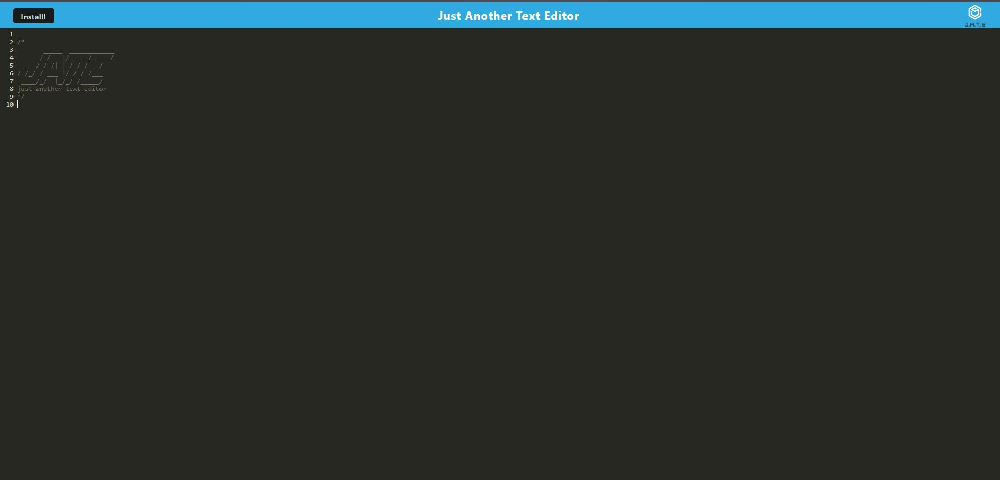
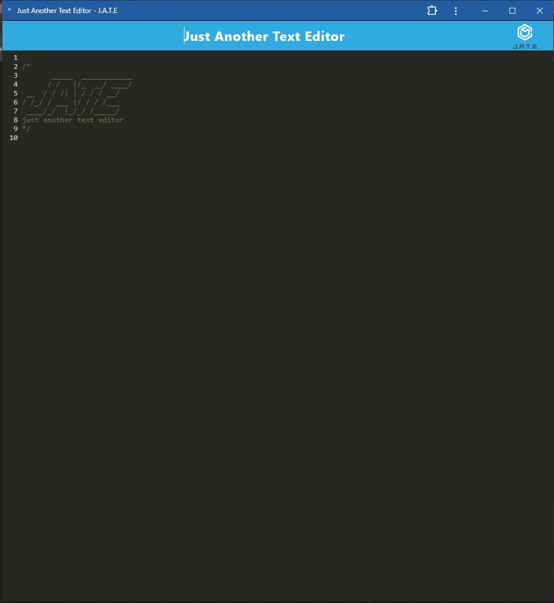

# text-editor

## Description

This project is a Progressive Web Application (PWA) that serves as a simple text editor. It works both online and offline, saving data locally and providing a seamless user experience. The app is installable and available for use in environments where internet connectivity might be intermittent or unavailable.

Features
- Installable PWA: Can be installed and used as a standalone desktop or mobile app.
- Offline Functionality: Saves data locally using IndexedDB, allowing users to continue working even when offline.
- Auto Save: Automatically saves text input locally to prevent data loss.
- Modern UI: Clean, simple, and responsive design for a better user experience.
- Rich Text Formatting: Supports basic text formatting like bold, italic, and underline.
- Local Storage Sync: Data syncs across sessions by storing text in the browser's IndexedDB.

([Link to deployed website](https://text-editor-vkti.onrender.com/))

([Code source location](https://github.com/Ashleighjg/text-editor))

Tech Stack
- Node.js: JavaScript runtime environment.
- Express.js: Web framework for Node.js, used for routing.
- JavaScript (ES6+)
- Service Workers for offline functionality
- IndexedDB for data persistence
- Webpack for module bundling
- Babel for transpiling ES6+ code

## Table of Contents

- [Installation](#installation)
- [Usage](#usage)
- [License](#license)
- [Contributing](#contributing)
- [Tests](#tests)
- [Questions](#questions)

## Installation

- install dependencies
- run npm install
- run npm start

## Usage

- Open the application in your browser.
- Begin typing in the editor. Your content will automatically be saved in local storage and available when you reopen the app.
- To install the PWA, look for the install button
- The app will function offline once installed, allowing you to access and edit your text even without an internet connection.

## License

This project is licensed under the ([MIT](https://opensource.org/licenses/MIT)) license.

## Contributing

Portions of this code is sourced from Xpert Learning Assistant.

([Xpert Learning Assistant](https://bootcampspot.instructure.com/courses/6022/external_tools/313))

## Tests

N/A

## Questions

If you have any questions you can email me at Ashleighjg@gmail.com or contact me via Github [Ashleighjg](https://github.com/Ashleighjg)